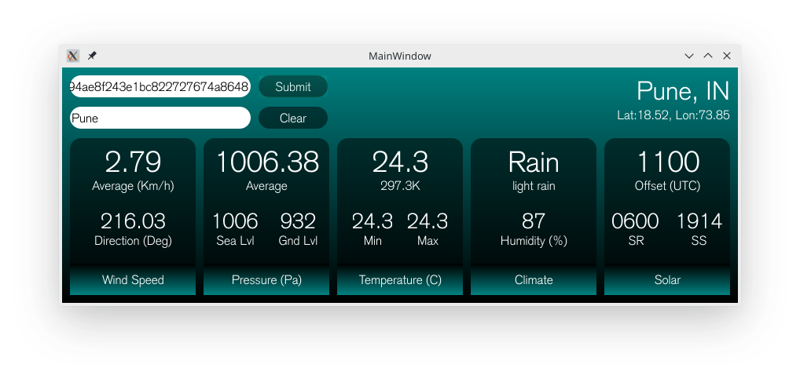

# foliage
## Foliage - A beautiful and user-friendly GUI weather application

### Requirements
1. PyQT5
2. Requests
3. JSON for Python
4. OpenWeatherMap Free API Key
5. QT Designer
6. Any code editor
7. Active internet connection

### Introduction
This is a simple, beautiful and user-friendly GUI weather application which takes OpenWeatherMap API key and the city that you are interested in to find advanced weather information of that place. 

### Features
At this point of time, this is the set of features that work with a pretty good waiting period.
1. **Location information** - Original name of the city with country name along with precise coordinates.
2. **Wind data** - Wind speed (in kilometers per hour) and direction (in degrees)
3. **Pressure data** - Average pressure, pressure at sea level and ground level (in pascals)
4. **Temperature data** - Average temperature with minimum and maximum (in celcius and kelvin)
5. **Climate information** - Main and description of current climate with humidity level
6. **Solar data** - Timezone data (in UTC offset) with sunrise and sunset local timings.

### Bugs/Drawbacks
1. **Unprecedented blocking** - Requests more than the given limit in free tiered OpenWeatherMap accounts result in a generalised error without an indication of blockinh.
2. **Unresolved exception** - Some search requests result in unresolved exception which are handled generally but a workaround is yet to be provided to the user.
3. **Messed up fontfaces** - At some places, paddings and margins need to be provided judiciously in order to make sure that suspended and headed regions are visible.

### Screenshots
Testing Default

Testing Pune, IN

